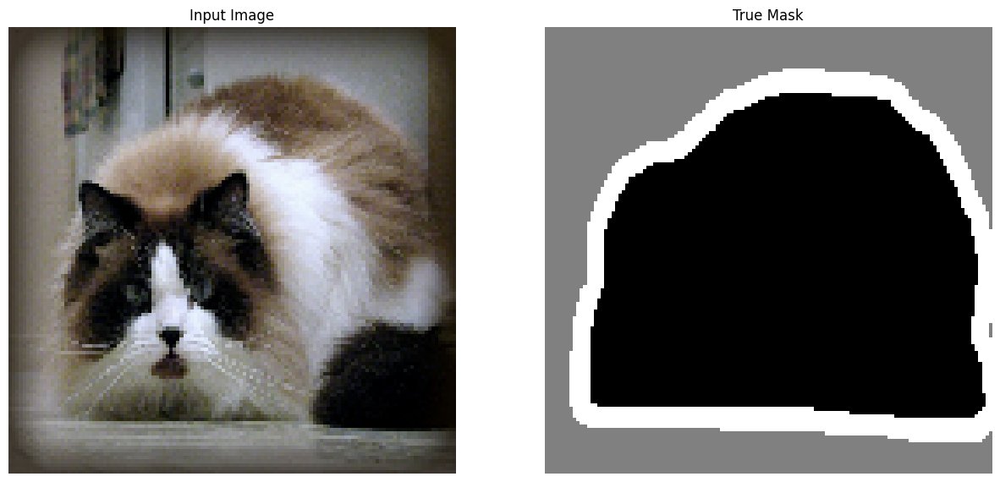
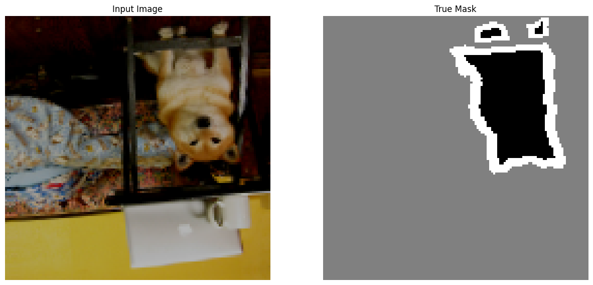

# Animal Segmentation

The goal of this project is to perform image segmentation on animals (cats and dogs) using the U-Net model.

## Dataset
You can find the dataset here:  
[The Oxford-IIIT Pet Dataset](https://www.robots.ox.ac.uk/~vgg/data/pets/)

The dataset consists of 7,349 images and masks, divided into two classes:
- Cats
- Dogs

## Model
This notebook uses a U-Net architecture, implemented with an input image size of (128, 128, 3).  

The U-Net model achieved the following accuracies:
- **Training Accuracy:** 90.7%
- **Validation Accuracy:** 90.5%
- **Test Accuracy:** 90.6%

The model ran for 20 epochs, and the best model was obtained at epoch 10 with data augmentation.

## Sample Images
Here are some sample images and their corresponding masks:
- **Cat Image and Mask**  
  
- **Dog Image and Mask**  
  

## Deployment
You can try the model live on Hugging Face:  
[Animal Segmentation Demo](https://huggingface.co/spaces/YousefAshraf/demo_animal_seg)
